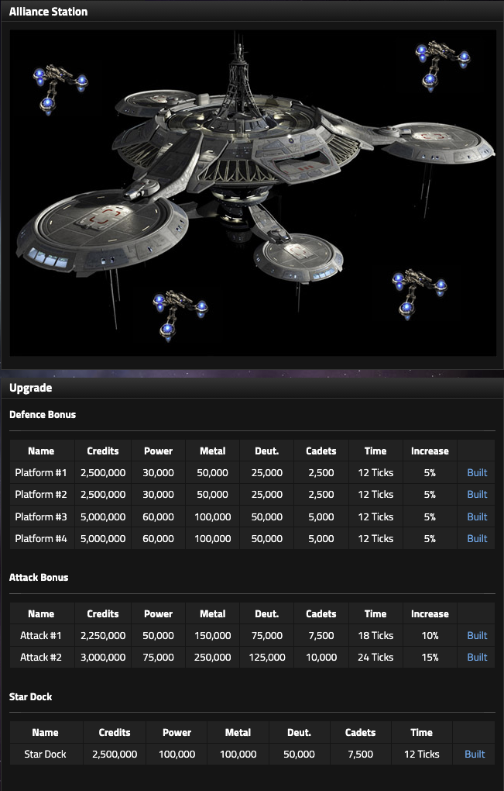
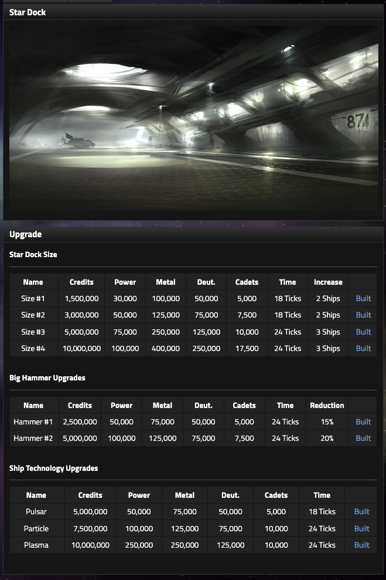

# Alliance Station

## What the Alliance Station does

The Alliance Station turns donated resources into shared military capacity. It serves three strategic purposes:

1. **Alliance-wide combat upgrades**
2. **Shared ship construction**
3. **Recovery support for weak or respawned empires**

The Station includes:

- Station Overview
- Star Dock Overview
- Fund / Stock
- View Stock
- Donation Log
- My Donation Stats

A Station donation can therefore become a permanent alliance bonus or a replacement ship rather than merely leaving your empire.

---

## Station stock

Station resources include:

- Credits
- Power
- Metal
- Deuterium
- Iridium
- Cadets

The interface gives an important warning:

> With the exception of Credits, donated resources cannot be removed from the Station or sent directly back to alliance empires.

Donated **Credits can be sent back to alliance empires by the Alliance Leader or Commanders**.

Other donated resources remain Station stock for upgrades, technology, and ship construction.

!!! tip "Planning note"
    Ask what the alliance is currently building before donating.

    A donation may help fund:

    - alliance Attack bonuses
    - alliance Defence bonuses
    - Station shipyard capacity
    - faster Station shipbuilding
    - Station ship technology
    - replacement ships for recovering members

    Cadets are often especially valuable because Station-built ships must still be crewed.

---

## Alliance-wide combat upgrades

<figure class="sf-figure" markdown="1">
  
  <figcaption>Alliance-wide combat upgrades and the shared Star Dock unlock.</figcaption>
</figure>

Station upgrades can directly increase the combat strength of alliance members.

### Defence bonus

Each Defence Platform upgrade adds:

**+5% Defence**

| Upgrade | Credits | Power | Metal | Deuterium | Cadets | Time | Increase |
|---|---:|---:|---:|---:|---:|---:|---:|
| Platform #1 | 2,500,000 | 30,000 | 50,000 | 25,000 | 2,500 | 12 ticks | +5% Defence |
| Platform #2 | 2,500,000 | 30,000 | 50,000 | 25,000 | 2,500 | 12 ticks | +5% Defence |
| Platform #3 | 5,000,000 | 60,000 | 100,000 | 50,000 | 5,000 | 12 ticks | +5% Defence |
| Platform #4 | 5,000,000 | 60,000 | 100,000 | 50,000 | 5,000 | 12 ticks | +5% Defence |

With all four completed, the listed upgrades provide:

**+20% Defence**

### Attack bonus

| Upgrade | Credits | Power | Metal | Deuterium | Cadets | Time | Increase |
|---|---:|---:|---:|---:|---:|---:|---:|
| Attack #1 | 2,250,000 | 50,000 | 150,000 | 75,000 | 7,500 | 18 ticks | +10% Attack |
| Attack #2 | 3,000,000 | 75,000 | 250,000 | 125,000 | 10,000 | 24 ticks | +15% Attack |

With both completed, the listed upgrades provide:

**+25% Attack**

### Why this matters

Station upgrades convert private empire resources into alliance-wide military value. The return is shared: one member donates, every member can benefit from the completed combat bonus.

---

## Unlocking the Station Star Dock

The shared Star Dock is itself an upgrade.

| Upgrade | Credits | Power | Metal | Deuterium | Cadets | Time |
|---|---:|---:|---:|---:|---:|---:|
| Star Dock | 2,500,000 | 100,000 | 100,000 | 50,000 | 7,500 | 12 ticks |

Once available, the Station can collectively build ships.

Those ships can later be sent to eligible members, which is particularly useful after war losses and respawns.

A recovering empire can receive Station ships while its Networth is **at or below the alliance average Networth**.

---

## Star Dock size

<figure class="sf-figure" markdown="1">
  
  <figcaption>Star Dock capacity, build-speed, and ship-technology upgrades.</figcaption>
</figure>

Station Star Dock Size upgrades increase the number of ships the Station can hold/build.

| Upgrade | Credits | Power | Metal | Deuterium | Cadets | Time | Increase |
|---|---:|---:|---:|---:|---:|---:|---:|
| Size #1 | 1,500,000 | 30,000 | 100,000 | 50,000 | 5,000 | 18 ticks | +2 ships |
| Size #2 | 3,000,000 | 50,000 | 125,000 | 75,000 | 7,500 | 18 ticks | +2 ships |
| Size #3 | 5,000,000 | 75,000 | 250,000 | 125,000 | 10,000 | 24 ticks | +3 ships |
| Size #4 | 10,000,000 | 100,000 | 400,000 | 250,000 | 17,500 | 24 ticks | +3 ships |

All four listed upgrades add a total of:

**+10 Station ship slots**

---

## Station Big Hammer

The Station has its own Big Hammer upgrades for reducing Station ship construction time.

| Upgrade | Credits | Power | Metal | Deuterium | Cadets | Time | Reduction |
|---|---:|---:|---:|---:|---:|---:|---:|
| Hammer #1 | 2,500,000 | 50,000 | 75,000 | 50,000 | 5,000 | 24 ticks | 15% |
| Hammer #2 | 5,000,000 | 100,000 | 125,000 | 75,000 | 7,500 | 24 ticks | 20% |

Together, the listed reductions total:

**35% faster Station ship construction**

---

## Station ship technology

The Station must develop its own ship technology to build more advanced hulls.

| Technology | Credits | Power | Metal | Deuterium | Cadets | Time |
|---|---:|---:|---:|---:|---:|---:|
| Pulsar | 5,000,000 | 50,000 | 75,000 | 50,000 | 5,000 | 18 ticks |
| Particle | 7,500,000 | 100,000 | 125,000 | 75,000 | 10,000 | 24 ticks |
| Plasma | 10,000,000 | 250,000 | 250,000 | 125,000 | 10,000 | 24 ticks |

Station technology is separate from an individual empire's research.

An empire having Plasma Technology does not substitute for the Station researching Plasma for its own shipyard.

---

## Donations and recovery logistics

The Station includes:

- a donation history
- personal donation statistics
- received Credits
- donated resource totals

The Station can function as a strategic reserve before a war and as a recovery engine afterward.

A useful alliance cycle is:

1. members donate excess or deliberately budgeted resources
2. the alliance develops shared Attack/Defence bonuses and Station infrastructure
3. the Station keeps replacement ships under construction
4. war creates weak or respawned empires
5. eligible recovering empires receive Station-built ships
6. the alliance rebuilds combat strength faster than those empires could alone

!!! tip "Planning note"
    Do not think of Station donations only as a sacrifice.

    The right question is:

    > Is this resource more valuable inside my empire right now, or converted into alliance-wide upgrades, Station capacity, or future replacement ships?

    That answer changes with war timing, alliance stock levels, and your own economic bottlenecks.
