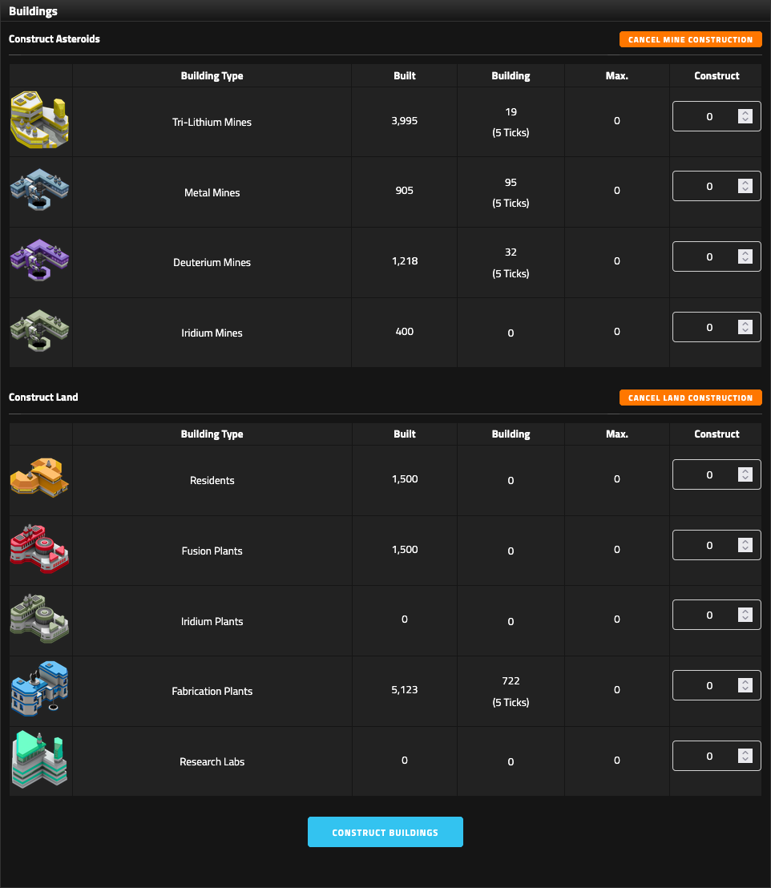

# Buildings and production

Buildings convert Land and Asteroids into the production that drives the empire. Start with the base rates, then apply research, race modifiers, and any round-specific modifier such as Alliance Catch Up.

<figure class="sf-figure" markdown="1">
  
  <figcaption>The Buildings page separates Asteroid and Land infrastructure and shows built quantities, work in progress, remaining timers, and available construction controls.</figcaption>
</figure>

## Asteroid buildings

| Building | Base effect | Important modifiers |
|---|---:|---|
| Tri-Lithium Mine | 150 Credits/tick | Advanced Mines I +25; II +25; race Credit modifiers; Catch Up |
| Metal Mine | 5 Metal/tick | race Metal modifier; Catch Up |
| Deuterium Mine | 2 Deuterium/tick | race Deuterium modifier; Catch Up |
| Iridium Mine | 1 Iridium/tick | Catch Up |

### Tri-Lithium Mines

Advanced Mines modifies the base **additively**:

- no Advanced Mines: 150 Credits/Mine/tick
- Advanced Mines I: 175
- Advanced Mines I + II: 200

Population Tax is separate income and is added after Mine production.

### Metal and Deuterium mines

The base rates are **5 Metal** and **2 Deuterium** per Mine per tick.

Race bonuses and penalties can make the effective per-Mine value look different. Marvion, for example, has -25% Metal and Deuterium production.

### Iridium Mines

Iridium Mines require the Iridium Mines technology and produce **1 Iridium per Mine per tick** before modifiers.

## Land buildings

| Building | Base effect | Important modifiers |
|---|---:|---|
| Resident | 2 Population/tick + 50 capacity | race Population modifier; Catch Up |
| Fusion Plant | 1 Power/tick | Advanced Power; race Power modifier; Catch Up |
| Iridium Plant | 0.5 Iridium/tick | Catch Up effect unverified |
| Fabrication Plant | 0.5 Probes/tick | Advanced Fabrication I and II |
| Research Lab | 3 RP/tick | race Research modifier; Catch Up effect unverified |

### Residents

Each Resident contributes both **2 Population/tick** and **50 Population capacity** before modifiers.

Population Tax does not change either Resident value.

### Fusion Plants

Base production is **1 Power per Plant per tick**.

Advanced Power I and II each add 50% of base production. With both, a Fusion Plant produces **2× base Power** before race and round modifiers.

### Iridium Plants

An Iridium Plant produces **0.5 Iridium/tick** from Land. An Iridium Mine produces **1 Iridium/tick** from Asteroids.

The Mine is twice as productive per building, but the two buildings consume different territory pools. That distinction can matter more than raw efficiency.

### Fabrication Plants

Base production is **0.5 Probes/Plant/tick**.

Advanced Fabrication I and II each add 50% of base production:

- base: 0.50
- + Advanced Fabrication I: 0.75
- + Advanced Fabrication II: 1.00

Alliance Catch Up does not appear to boost Probe production in Horizon LIII.

### Research Labs

Base production is **3 Research Points/Lab/tick**.

Ferrion's +25% Research modifier raises the effective base to 3.75 RP/Lab/tick before any other modifier.

Whether Horizon LIII Catch Up also affects Research Points is unverified.

## Related production

### Population Tax

Population Tax I adds **1 Credit per Population per tick**. Population Tax II adds another 1.

With both, 97,500 Population produces:

`97,500 × 2 = 195,000 Credits/tick`

Horizon LIII Catch Up does not appear to multiply this tax income.

### Recruits

Base Recruit production is:

`Population × 0.005`

The Horizon LIII +30% Catch Up state increases that to `Population × 0.0065` for an affected alliance.

## Production rounding

The Production page displays whole numbers. Examples such as 172.5 displaying as 172 show that the visible interface drops the fractional part.

!!! question "Unverified"
    It is not yet known whether the server discards the fraction permanently or retains hidden fractional progress between ticks.

## Construction capacity and cost

The Buildings page shows available Land/Asteroids, construction price, built quantity, in-progress quantity, timers, and the maximum quantity you can start.

Building price is dynamic. Earlier V5 states showed 500 Credits per building while a mature Horizon LIII empire showed 1,140. Total Land + Asteroids is a suspected driver, but the formula is not confirmed.

!!! tip "Planning note"
    Use the price shown on your Buildings page. Treat buildings under construction as future production, not current production.

## Razing buildings

Razing costs **50 Credits per building**.

The cost is small compared with the production you may destroy. Before razing, account for both the demolition cost and the lost output per tick.

## Evaluate a building by the bottleneck

Do not ask which building is universally best. Ask which resource blocks your next valuable action.

Three useful tests are:

**Break-even**

`building cost / additional production per tick`

**Territory efficiency**

`useful production / Land or Asteroid slot`

**Deadline value**

Will the additional production arrive before you need it?

A Research Lab can be worth more than a Credit building when research is the bottleneck. A Fusion Plant can be worth more than either when Power prevents the next fleet build.
