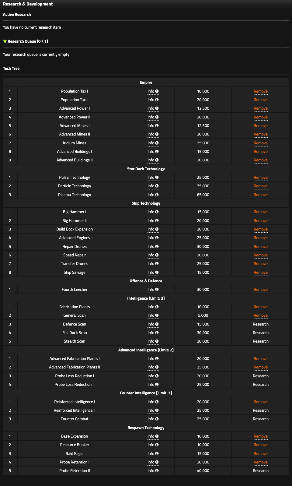

# Research

Research converts Research Points into economic, military, intelligence, and respawn capabilities. The important constraint is not only RP cost. Research also consumes time and, in several intelligence branches, a limited selection slot.

<figure class="sf-figure" markdown="1">
  
  <figcaption>The Research page groups technologies by family and shows RP cost, selection limits, active states, and any VIP Research Queue capacity.</figcaption>
</figure>

## How research works

The Research page shows RP/tick, active research, the technology tree, costs, and any Research Queue provided by VIP.

For one technology:

`ETA ticks = ceiling(remaining RP / RP per tick)`

Unused RP does **not** spill into the next queued technology. When a technology finishes, the next one starts at 0 RP.

!!! warning "Before you switch research"
    Removing active research can destroy invested progress or remove an active benefit, depending on the technology and state. Do not switch casually.

## Research Queue and VIP

Research Queue is a supporter feature:

- Falcon Tier ($10/month): 1 queue slot
- Dreadnaught Tier ($15/month): 2 queue slots

Higher tiers inherit lower-tier benefits. Without a queue, you research one technology at a time.

## Research families

The V5 tree is organized into:

- Empire
- Star Dock Technology
- Ship Technology
- Offence and Defence
- Intelligence
- Advanced Intelligence
- Counter Intelligence
- Respawn Technology

Selection limits matter in the intelligence branches:

- Intelligence: limit 3
- Advanced Intelligence: limit 2
- Counter Intelligence: limit 1

Treat those limits as build choices, not a checklist to complete.

## Empire research

| Technology | Cost | Requirement | Effect |
|---|---:|---|---|
| Population Tax I | 10,000 RP | None | +1 Credit/Population/tick |
| Population Tax II | 20,000 RP | Population Tax I | another +1 Credit/Population/tick |
| Advanced Power I | 12,500 RP | None | +50% base Fusion Plant Power |
| Advanced Power II | 20,000 RP | Advanced Power I | another +50% base Power; increases storage |
| Advanced Mines I | 12,500 RP | None | +25 Credits/Tri-Lithium Mine/tick |
| Advanced Mines II | 20,000 RP | Advanced Mines I | another +25 Credits/Mine/tick |
| Iridium Mines | 25,000 RP | None | unlocks Iridium Mines |
| Advanced Buildings I | 15,000 RP | None | -25% Land/Asteroid construction time |
| Advanced Buildings II | 20,000 RP | Advanced Buildings I | another -25% construction time |

With both Advanced Buildings technologies, maximum building time falls from 16 ticks to 8.

## Star Dock technology

| Technology | Cost | Requirement | Effect |
|---|---:|---|---|
| Pulsar Technology | 25,000 RP | None | unlocks an advanced ship tier |
| Particle Technology | 35,000 RP | Pulsar | unlocks a later ship tier |
| Plasma Technology | 65,000 RP | Particle | unlocks Plasma-tier capability |

!!! warning "Path choice"
    Plasma Technology conflicts with Probe Retention II. Treat that as a deliberate strategic choice, especially if you expect to respawn.

## Ship technology

| Technology | Cost | Requirement | Effect |
|---|---:|---|---|
| Big Hammer I | 15,000 RP | None | -15% ship build time; better scrap return |
| Big Hammer II | 20,000 RP | Big Hammer I | another -20% build time; better scrap return |
| Build Dock Expansion | 20,000 RP | None | increases Build Dock capacity |
| Advanced Engines | 25,000 RP | None | -25% ship return time |
| Repair Drones | 30,000 RP | None | faster repair |
| Speed Repair | 20,000 RP | Repair Drones | 1-tick repair at 20% original build cost |
| Transfer Drones | 25,000 RP | None | reduces ship-transfer time |
| Ship Salvage | 15,000 RP | None | returns resources when a ship dies while Defending |

Big Hammer I + II stack additively for **35% shorter ship construction**. A 72-tick Star Fury builds in 46 ticks; a 20-tick GunShip builds in 13.

Speed Repair costs 20% of the original ship build cost in Credits, Power, Metal, and Deuterium. It is available only from the Defence page and only while the ship is Defending.

Advanced Engines affects **return time**, not the fixed 4 / 6 / 8 tick Exploration missions.

## Offence and Defence research

**Fourth Leecher, 30,000 RP** increases Leecher Dock capacity.

Dock capacities can differ by race, so use the live Star Dock for your actual limit.

## Intelligence research

| Technology | Cost | Effect |
|---|---:|---|
| Fabrication Plants | 10,000 RP | unlocks regular Probe production and the building |
| General Scan | 5,000 RP | broad target information |
| Defence Scan | 15,000 RP | Defence and relevant defensive assets |
| Full Dock Scan | 30,000 RP | detailed ships, docks, and status |
| Stealth Scan | 20,000 RP | returns Defence only; successful scan does not notify target |

Advanced Fabrication I and II each add 50% of base Fabrication Plant output. With both, the base rate reaches **1 Probe/Plant/tick**.

Counter Intelligence includes probe reinforcement and **Counter Combat**, which can capture Probes from a failed enemy scan.

!!! question "Unverified"
    The exact Counter Combat capture formula is not yet known.

## Respawn technology

Respawn research becomes available later in the round. The tree includes:

- Base Expansion
- Resource Bunker
- Raid Eagle
- Probe Retention I
- Probe Retention II

These technologies improve the empire that returns after defeat.

Do not prioritize them automatically. Their value depends on round timing, war pressure, and whether you expect the empire to die.
