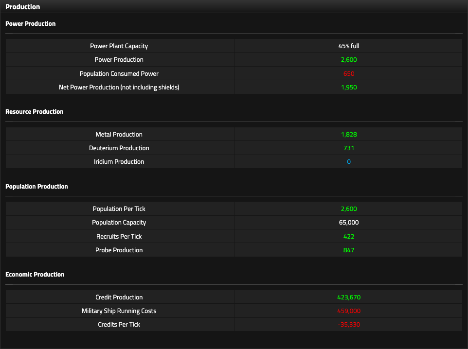
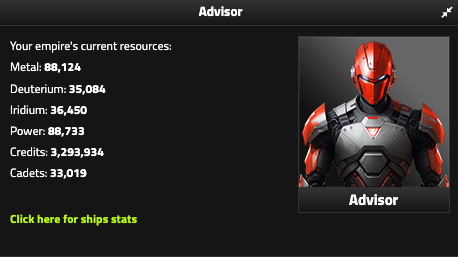

# Resources and economy

Star Fury uses multiple resources so that useful actions compete with one another. A ship consumes money, materials, Power, Cadets, construction time, and maintenance. Research competes with other research. Territory limits what you can build.

The useful question is not "Which resource is best?" It is "Which resource blocks my next valuable action?"

<figure class="sf-figure" markdown="1">
  
  <figcaption>The Production page separates gross production from consumption and recurring costs. Use it to identify the resource actually constraining the empire.</figcaption>
</figure>

## Checking your current balances

The **Production** page tells you how quickly resources are changing. When you need the empire's current spendable totals, the **Advisor panel on the Star Dock page** provides a convenient snapshot of:

- Metal
- Deuterium
- Iridium
- Power
- Credits
- Cadets

<figure class="sf-figure sf-figure-compact" markdown="1">
  
  <figcaption>The Star Dock Advisor is a quick way to check the major resources available for ship construction and other spending.</figcaption>
</figure>

This panel does **not** replace the Production page. It shows current balances, while Production shows rates such as Metal per tick, Credits per tick, Population growth, and recurring ship costs.

## Resource model

| Resource | What it constrains |
|---|---|
| Credits | buildings, ships, Cadet training, repairs, maintenance, many upgrades |
| Power | ships, shields, Station upgrades, economic headroom |
| Metal | shipbuilding and Station construction |
| Deuterium | shipbuilding, Warp Shield, Station construction |
| Iridium | larger hulls and advanced construction |
| Population | Recruit production, Population Tax, economic scaling |
| Recruits | source pool for training Cadets |
| Cadets | ship crews and Station construction |
| Probes | intelligence scans and raid Intel |
| Research Points | technology |
| Land | Land buildings and survival in Land attacks |
| Asteroids | Mine construction and survival in Asteroid attacks |
| Exploration Points | exploration yield system |

## Credits

Read Credits in three layers:

**Credit Production** is gross income.

**Military Ship Running Costs** are the most visible recurring expense.

**Credits Per Tick** is what actually accumulates.

!!! tip "Planning note"
    After a large fleet build, check Credits Per Tick again. Purchase price is only the first cost of a ship.

## Power

Fusion Plants produce Power and Population consumes part of it. Ships also commit Power through their **Power Core**.

Starting construction removes the listed Power Core from available empire Power immediately. Two Corvettes with 2,000-Power cores, for example, commit 4,000 Power.

Retirement and salvage can return part of that committed Power, but they do not simply refund the full Power Core.

!!! tip "Planning note"
    Treat Power as both production and reserve capacity. A large balance can disappear quickly when you queue ships or activate wartime systems.

## Metal, Deuterium, and Iridium

**Metal** and **Deuterium** are core shipbuilding materials produced from Asteroid infrastructure.

**Iridium** becomes increasingly important on larger hulls and advanced systems. You can produce it from an **Iridium Mine** on Asteroids or an **Iridium Plant** on Land, which lets you trade one territory pool for another.

Do not wait for a hull to unlock before checking whether your production mix can build it.

## Population, Recruits, and Cadets

### Population

Each Resident has two base effects:

- **2 Population per tick**
- **50 Population capacity**

Race and dynamic round modifiers can change both values.

Population Tax is separate. It converts existing Population into Credits; it does not increase Population or capacity.

### Recruits

Base Recruit production is:

`Population × 0.005`

That is **1 Recruit per 200 Population per tick** before applicable dynamic modifiers.

The Production page displays whole-number totals. Whether the server retains hidden fractional progress is not yet known.

### Cadets

Training costs **250 Credits per Cadet**.

Keep Cadet training **Manual** so you decide when to convert Credits and Recruits. During normal growth, train for planned construction and a reasonable buffer.

Before a dangerous war, the logic changes: **trained Cadets survive death and respawn with your empire**. If you can afford the conversion without blocking a more urgent need, a large trained reserve can make the post-respawn rebuild much faster.

## Alliance Catch Up

!!! note "Round-specific: Horizon LIII"
    Alliance Catch Up is an administrator-controlled peace-time modifier intended to help a trailing alliance recover before its next war. It can be enabled, disabled, or adjusted, so the percentage is not a permanent game rule.

For the affected alliance in Horizon LIII, production reconciles to an effective **×1.30 economic multiplier** on several outputs.

| Affected output | Base or researched value | With ×1.30 Catch Up |
|---|---:|---:|
| Resident capacity | 50 | 65 |
| Population production | 2/Resident/tick | 2.6 |
| Metal Mine | 5/tick | 6.5 |
| Deuterium Mine | 2/tick | 2.6 |
| Iridium Mine | 1/tick | 1.3 |
| Recruit production | Population × 0.005 | Population × 0.0065 |

The same modifier also reconciles with researched/racial Fusion Plant Power and Tri-Lithium income.

It does **not** appear to multiply:

- Population Tax income
- Probe production

Still unverified:

- Research Points
- Iridium Plants
- construction speed
- Exploration
- combat stats

??? example "Verification details"
    A Ferrion empire with 1,500 Residents, 850 Metal Mines, 1,200 Deuterium Mines, and 400 Iridium Mines produced exactly the values predicted by a ×1.30 modifier:

    `1,500 × 50 × 1.30 = 97,500 Population capacity`

    `850 × 5 × 1.30 = 5,525 Metal/tick`

    `1,200 × 2 × 1.30 = 3,120 Deuterium/tick`

    `400 × 1 × 1.30 = 520 Iridium/tick`

    With Advanced Power I + II and Ferrion's +25% Power modifier:

    `1,500 × 1 × 2.00 × 1.25 × 1.30 = 4,875 Power/tick`

    With Advanced Mines I + II, 3,986 Tri-Lithium Mines produced:

    `3,986 × 200 × 1.30 = 1,036,360 Credits/tick`

    Population Tax I + II then added `97,500 × 2 = 195,000 Credits/tick` separately, for a total of 1,231,360.

!!! tip "Planning note"
    Do not infer a base building rate by dividing your Production total by your building count unless you know which race, research, and round modifiers are active. Use the Production page for your empire's effective output.
