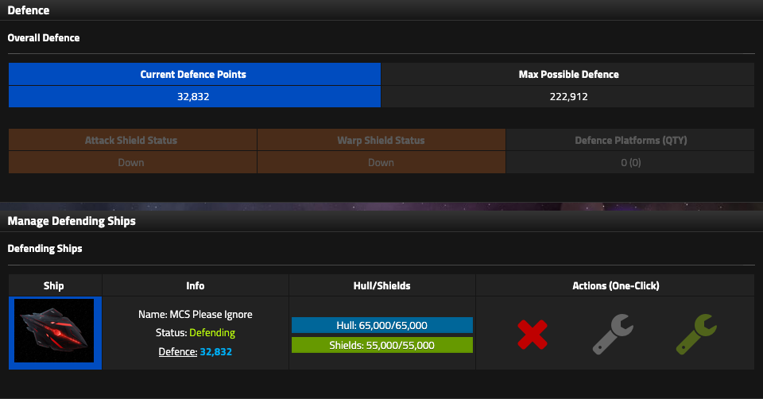

# Defence

The Defence page tells you what your empire can defend **now**, what it could defend if its eligible fleet were fully armed, and which wartime systems are active.

<figure class="sf-figure" markdown="1">
  
  <figcaption>Current Defence can be dramatically lower than Max Possible Defence when eligible ships are Disabled, Returning, Building, or configured away from Weapons.</figcaption>
</figure>

## Current Defence vs Max Possible Defence

### Current Defence

**Current Defence** is the Defence contributed right now by eligible Attack and Defence Dock ships under their present status and Weapons allocation.

Disabled, Returning, and Building ships do not contribute normal Current Defence.

### Max Possible Defence

**Max Possible Defence** is the W100 defensive potential of eligible ships in the Attack and Defence docks while they are in a ready/defending state.

A ship configured for exploration can therefore contribute little or no Current Defence while still representing substantial Max Possible Defence once rearmed.

!!! warning "Do not read Max Possible Defence as protection"
    Before war, check Current Defence, ship status, and W/E/S. Max Possible Defence is potential, not a shield around the empire.

## Wartime shields

Attack Shield and Warp Shield are available only during war and only if the alliance has unlocked the corresponding War Technology.

### Attack Shield

Attack Shield consumes a **variable amount of Power** when activated and again every tick while active.

### Warp Shield

Warp Shield consumes a **variable amount of Power and Deuterium** on activation and every active tick.

!!! question "Unverified"
    The shield-cost formulas are not yet solved. Costs have increased in later wars, which suggests scaling by an empire or war-state value, but the driver is not confirmed.

## Defence Platforms

Each completed Defence Platform contributes exactly **15 Defence Points**.

The contribution is fixed. Race, research, shields, and other known empire modifiers do not change the 15-point value.
