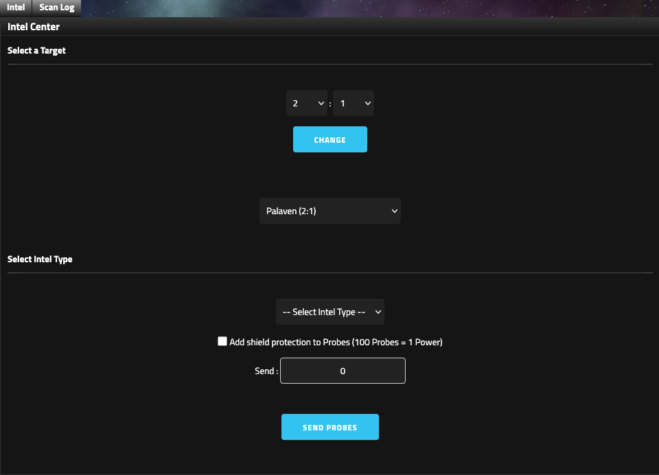
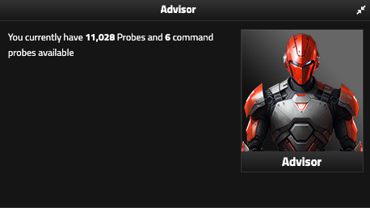

# Intelligence and universe

Intelligence turns a target from a Networth number into something you can plan against. Scans reveal different layers of an empire; Universe pages tell you where that empire sits in the wider round.

<figure class="sf-figure" markdown="1">
  
  <figcaption>The Intelligence Center is where you choose a target, select the scan type, optionally shield the Probe attempt, and choose how many Probes to send.</figcaption>
</figure>

## Intelligence Center

The Intelligence page shows:

- regular Probes
- Command Probes
- available scan types
- target selection
- Scan Log
- optional Probe shielding

Probe shielding converts at **100 Probes = 1 Power**.

## Scan types

Available scans depend on research.

### General Scan

Broad empire information, including resources, Probes, and ship information.

### Defence Scan

Defensive information, including Defence and relevant defensive assets.

### Full Dock Scan

Detailed ships, docks, and active statuses.

### Stealth Scan

Returns the target's **Defence number only**. A successful Stealth Scan does **not** notify the target.

## Command Probes

<figure class="sf-figure sf-figure-compact" markdown="1">
  
  <figcaption>The Advisor panel shows the empire's available Probe pool and remaining Command Probes.</figcaption>
</figure>

Every scan consumes **1 Command Probe**.

Command Probes regenerate at **1 per tick** up to the race maximum.

Race modifiers change that maximum:

- Herogen: double Command Probes
- Versuden: half Command Probes

Other races use the normal capacity shown by the Intelligence page.

!!! tip "Planning note"
    Command Probes limit how many scans you can send in a short window. During war preparation, budget them across likely targets rather than spending them casually.

## Universe Browser

The Universe Browser lists empires by sector and includes coordinates, Land, Asteroids, Networth, and rank.

Status colors are:

- Blue: Newbie
- Green: Vacation
- Purple: Disbanding
- Orange: your empire
- Black: dead

## Universe Scores

Scores includes:

- Top Scores
- Attack Statistics
- Defence Statistics
- General Stats
- My Empire Stats

General Stats is strategically useful because it includes round-wide values such as average Networth, average Land, average Asteroids, average Probes, highest Probe count, alliance statistics, total ships, and ship-class distribution.

Average Probes feeds directly into raid Intel planning. Ship distribution also gives you a rough sense of how far the round has progressed.

## Galaxy and sector leaders

An empire in an alliance above **1,500,000 alliance Networth** may claim a free Galaxy Leader role.

An empire in an alliance above **750,000 alliance Networth** may claim a free Sector Leader role.

Check the role information before claiming one; leadership is not merely cosmetic.

## Universe News

Universe News records alliance diplomatic events:

- Blue: peace treaty
- Green: neutral treaty
- Red: war declaration
- Orange: alliance disbanded or defeated

If you are returning after time away, this is one of the fastest ways to understand the political state of the round.
