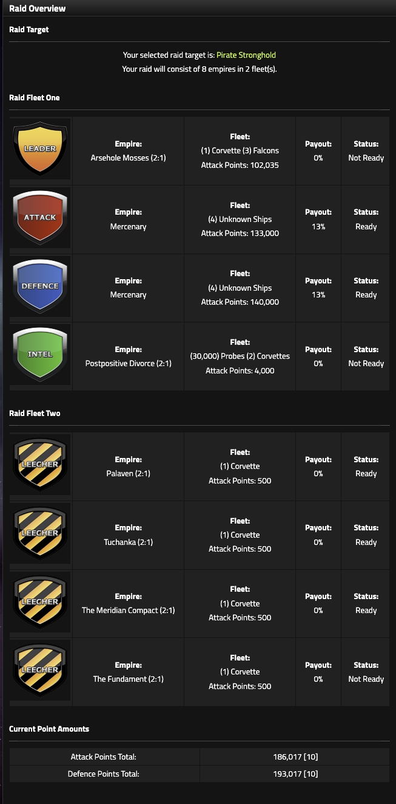
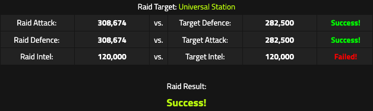

# Raids

## What is a raid?

Raids are PvE operations against generated targets in the **War Room**.

The Raid page tracks:

- daily raid limit
- ticks remaining before reset
- Raid Report
- Alliance Timers
- Raid Overview
- Raid Results

Raid limits are:

- **3 completed raids per empire per day**
- **6-hour cooldown between raids**

In practice, an empire that wants all three daily raids needs to spread them across the day rather than chain them back-to-back.

Two raid types also have their own target-specific limit:

- **Pirate Outpost:** maximum 2 per day
- **Pirate Stronghold:** maximum 2 per day

Those target limits do not increase the overall daily allowance. For example, an empire can complete two Pirate Outposts and one Pirate Stronghold in a day, but cannot complete a fourth raid.

### Territory-producing raids

Only two raid types award **Land and Asteroids**:

- Pirate Outpost
- Pirate Stronghold

All other raid targets pay resources without Land or Asteroids.

---

## Raid target difficulty and HIGH range

Raid targets display an Attack & Defence range.

Some targets can move into a **HIGH range** when the combat strength of the ships in your Raider Dock crosses a target-specific threshold. This is based on your available raid fleet strength rather than simply the age of the round.

The exact cutoff formula is not yet known.

The Raid page also gives a **maximum recommended target** based on the ships currently in your Raider Dock. This is only a recommendation. The game still allows you to choose a harder target.

!!! tip "Planning note"
    Adding powerful ships to the Raider Dock can make lower raid targets harder.

    Before reorganizing your Raider fleet, check whether doing so changes the displayed target range.

---

## Raid sizes and fleets

Raids can be organized as:

- **4-player raid:** 1 fleet of 4 empires
- **8-player raid:** 2 fleets of 4 empires each

An 8-player raid requires all **8 empire slots** to be assigned. You cannot finalize the payout split or complete the raid with empty empire slots.

The first fleet contains the core raid roles. The second fleet can use:

- Support Attack
- Support Defence
- Support Intel
- Leecher

Each participating empire has:

- a role
- an assigned fleet or probe contribution
- a payout percentage
- a Ready / Pending state

An incomplete raid expires after **4 ticks**.

<figure class="sf-figure" markdown="1">
  
  <figcaption>An 8-player raid uses two fleets of four. The overview shows each role, assigned empire, contribution, payout, readiness, and the combined Raid Attack and Defence totals.</figcaption>
</figure>

---

## Raid roles

### Leader

The Leader contributes:

- **50% of participating ship Attack to Raid Attack**
- **50% of participating ship Attack to Raid Defence**

If the Leader brings ships totaling 100,000 live Attack:

- +50,000 Raid Attack
- +50,000 Raid Defence

### Attack and Support Attack

Attack and Support Attack are dedicated Raid Attack roles.

**Working model:** 100% of participating ship Attack → Raid Attack

### Defence and Support Defence

Defence and Support Defence are dedicated Raid Defence roles.

**Working model:** 100% of participating ship Attack → Raid Defence

Raid Defence therefore uses the ships' **Attack Points**, not their normal empire Defence statistic.

!!! question "Unverified edge case"
    Attack/Support Attack and Defence/Support Defence behave as dedicated 100% roles in the working raid model. The manual has not yet isolated every edge case closely enough to rule out an additional modifier.

### Intel and Support Intel

Intel and Support Intel contribute probes to the Intel check.

Ships supplied by either Intel role also contribute:

- **50% of participating ship Attack to Raid Attack**
- **50% of participating ship Attack to Raid Defence**

Support Intel therefore allows an 8-player raid to add another probe contribution and another 50%/50% ship contribution alongside the main Intel empire.

### Leecher

Leechers are specialized raid participants.

They do **not** add normal Raid Attack or Raid Defence points and are excluded from the normal Attack/Defence incoming-damage divisors.

---

## Raid success checks

Raid results separate three major checks:

**Raid Attack vs Target Defence**

**Raid Defence vs Target Attack**

**Raid Intel vs Target Intel**

Attack and Defence are the required combat checks.

A raid can still succeed when the Intel check fails.

### Intel must exceed the target

The Intel comparison is **strict**:

`Raid Intel > Target Intel`

Matching the target exactly is not enough. In the observed Universal Station result below, **120,000 Raid Intel vs 120,000 Target Intel failed** even though the raid itself succeeded on Attack and Defence.

<figure class="sf-figure sf-figure-medium" markdown="1">
  
  <figcaption>Equality fails the Intel check. Your displayed Raid Intel must be at least 1 point higher than the target.</figcaption>
</figure>

### Successful Intel effect

A successful Intel check reduces both:

- target Attack by **10%**
- target Defence by **10%**

This happens before the combat thresholds are resolved.

---

## Raid Intel requirements

LOW-range raid targets have known maximum Intel/Probe values. The exact cap depends on raid type.

Because equality fails, the safe planning value for a known LOW-target cap is:

`maximum target Intel + 1`

For example, a LOW Universal Station can reach **120,000 Target Intel**, so use at least **120,001 displayed Raid Intel** if you want to guarantee clearing the Intel check against the known maximum.

See [Raid reference](../reference/raids.md#low-target-intel-caps) for the Horizon LIII cap table and cap-plus-one planning values.

!!! question "HIGH-range Intel"
    The Intel model for HIGH-range targets is not yet confirmed. Use the target Intel value shown by the raid interface rather than extrapolating from the LOW-range caps.

---

## Mercenaries

Raid mercenaries can fill:

- Attack
- Defence
- Intel
- Leecher

Attack, Defence and Intel mercenaries have three strength tiers:

- **Low:** 10% payout
- **Medium:** 13% payout
- **High:** 15% payout

The payout cost is fixed for the selected mercenary tier.

Leecher mercenaries use the payout shown by the live page.

### Common 8-player pattern

A common 8-player setup uses:

- Low Attack mercenary: 10%
- Low Defence mercenary: 10%
- 6 human-controlled empires sharing the remaining 80%

For example:

- Leader: 14%
- Intel: 14%
- four Leecher/support empires: 13% each

That produces:

`10 + 10 + 14 + 14 + 13 + 13 + 13 + 13 = 100%`

Human shares are editable, so players can use custom distributions as long as the final raid totals **100% payout**.

!!! tip "Planning note"
    The strongest mercenary is not automatically the best choice.

    Use the weakest mercenary that clears the required threshold with an acceptable safety margin. Every extra percentage paid to a mercenary is reward unavailable to the human empires.

---

## Raid payouts

Payout is distributed according to the finalized percentages shown in the raid party.

Mercenary percentages are fixed by tier. Human-controlled empire percentages are entered by the organizer and can be unequal.

The total must equal **100%** before the raid can be finalized.

A raid can therefore be combat-safe but economically unattractive to a particular empire if its payout share is small.

Treat raid safety and raid profitability as separate questions.

---

## Example: a three-player raid squad

A productive way to organize 8-player raids is to build a small, repeatable squad rather than assemble a fresh group every time.

One successful Horizon LIII pattern used:

- **3 human players**
- **2 empires each**
- **2 mercenary slots**
- a shared Discord group chat
- raids scheduled roughly every 6 hours, while still prioritizing real-life availability

Because each player controls two empires, the six human-controlled raid slots are already covered.

For each raid, one player acts as the **carry**:

- one of that player's empires takes **Leader**
- the other takes **Intel**
- the other two players' four empires fill **Leecher** or other low-burden support slots
- low Attack and Defence mercenaries fill the dedicated combat roles when they are sufficient

Across three daily raids, the group can rotate who carries:

1. Player A carries Raid 1
2. Player B carries Raid 2
3. Player C carries Raid 3

This spreads the expensive or demanding Leader/Intel responsibility across the squad while allowing every member's empires to participate in all three raids.

### Why this works

The structure fits the raid rules:

- 8-player raids require all 8 empire slots
- two Low mercenaries consume 20% total payout
- six human empires can divide the remaining 80%
- Leader and Intel can provide meaningful combat contribution while also satisfying the raid's coordination and Intel requirements
- the 6-hour cooldown naturally encourages a scheduled cadence

This is an **example coordination model**, not a required or universally optimal raid setup. Different fleet strengths, payout agreements, availability, and raid targets can justify different role assignments.

## Raid damage and losses

Raid combat uses two incoming-damage phases.

For each relevant combat phase, target points are divided across the ships participating in that phase.

??? example "Verification example"
    In one controlled raid, Target Defence was 195,700, Target Attack was 206,000, and 12 combat ships participated in both phases.

    `195,700 / 12 = 16,308.33`

    `206,000 / 12 = 17,166.67`

    Total incoming damage was **33,475 per ship**, exactly matching the post-raid ship damage.

When the same ships participate in both phases:

`incoming damage per combat ship = target Defence / Attack-phase ship count + target Attack / Defence-phase ship count`

If the participating ship counts differ between the two phases, calculate each phase separately.

**Leechers are not included in these Attack/Defence combat divisors.**

!!! tip "Planning note"
    Do not divide target damage by the number of empires in the raid.

    Count the ships participating in each combat phase.

    A ship can help the raid clear both thresholds and still die from incoming phase damage, so raid planning needs both:

    - a threshold check
    - a survivability check
