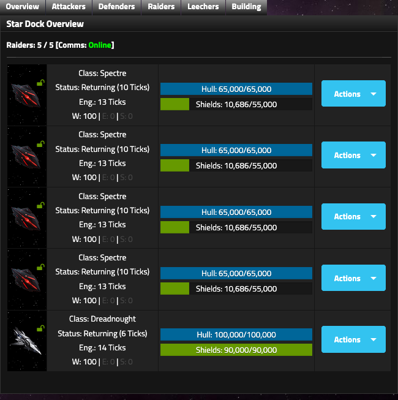

# Ships

## What a ship really costs

A ship can consume:

- Credits
- Power
- Metal
- Deuterium
- Iridium
- Cadets
- construction ticks
- a construction slot
- continuing maintenance

This makes "Can I afford it?" a poor question.

Ask instead:

> Can I afford to build it, crew it, power it, maintain it and wait for it, while delaying everything else I could build?

Before committing to a build, the **Star Dock Advisor** provides a quick snapshot of your current Metal, Deuterium, Iridium, Power, Credits, and Cadets. Use the **Production** page alongside it to check whether those balances are growing or shrinking.

---

## Star Dock roles

The Star Dock separates ships into:

- Attackers
- Defenders
- Raiders
- Leechers
- Building

Each role has a different strategic job.

<figure class="sf-figure" markdown="1">
  
  <figcaption>The Star Dock overview lets you inspect role groupings, ship state, W/E/S allocation, Hull and Shields, and the actions available to each ship.</figcaption>
</figure>

---

## Attack ships

Attack ships perform normal attacks and can contribute to empire Defence.

Before race, research, W/E/S, and Fixed/Flexible modifiers, Attack-role ships use:

| Stat | Attack role |
|---|---:|
| Attack | 100% |
| Damage | 100% |
| Defence | 75% |

Attack role is therefore offensively efficient but provides less defensive contribution than Defence role.

---

## Defence ships

Defence ships provide full role Defence and are the ships eligible for Exploration when configured correctly.

Before other modifiers, Defence-role ships use:

| Stat | Defence role |
|---|---:|
| Attack | 75% |
| Damage | 75% |
| Defence | 100% |

Defence ships can still attack, but at reduced Attack and Damage compared with the same hull in Attack role.

---

## Raider ships

Raider ships participate in PvE raids.

A Raider contributes **no empire Defence** and is not part of normal wartime Attack/Defence dock combat.

For raids, Raider ships use **100% of their live Attack Points** when their assigned raid role calls for ship Attack. Normal ship Damage is not used as a separate raid stat.

---

## Leecher ships

Leecher is a specialized raid and combat role.

A Leecher:

- can participate in raid Leecher positions
- can appear in normal attack selection
- can be power-modified when its state permits
- **cannot change role**

Because a Leecher cannot change role, Flexible normally provides little benefit while still imposing the Flexible combat penalty.

A Fixed Leecher is therefore a strong default.

---

## Fixed vs Flexible

### Fixed

A Fixed ship cannot transfer directly to another role.

It receives no inherent Flexible combat penalty.

Fixed controls role transfer, not whether a ship may be power-modified. Modification availability also depends on ship state.

Switching a ship between **Fixed and Flexible takes 4 ticks in either direction**.

### Flexible

A Flexible ship can transfer among compatible roles.

The Ship Viewer allows transfer when the ship is **Defending**.

Flexible imposes an exact combat penalty of:

- **-5% Attack**
- **-5% Damage**
- **-5% Defence**

!!! tip "Planning note"
    Choose Flexible because you have a plausible future role change, not because "flexible sounds better."

    Flexibility is purchased with permanent combat performance.

---

## Ship Power allocation

Every ship distributes its Power Core among:

- Weapons
- Engines
- Sensors

The values total 100%.

A W/E/S power modification takes **2 ticks** when the ship is eligible to be modified.

### Weapons

Weapon allocation scales combat output.

Controlled tests show a Corvette with base 2,000 Attack and 2,400 Damage at 25% Weapons displaying 500 Attack and 600 Damage before other empire modifiers.

Weapons power controls the ship's combat contribution.

At **W0**, Attack and Damage fall to zero, which also leaves the ship contributing zero current Defence in Attack or Defence docks.

Do not leave wartime Attack, Defence, or Raider ships at W0.

### Engines

Engine allocation reduces **return time** after an attack.

The exact allocation formula is not yet known.

With Advanced Engines in one measured case:

- Corvette at E0: 8-tick return
- Leecher Corvette at E75: 4-tick return

Normal PvP attacks have no separate outbound travel status: the attack resolves immediately and the attacking ship then enters Returning.

Engine allocation does **not** change the fixed 4 / 6 / 8 tick Exploration mission lengths.

### Sensors

A ship must be in the **Defence Dock** and at **S100** to be eligible for Exploration.

The exact Sensor formula outside that eligibility rule is not yet decoded.

Do not use a balanced W/E/S split merely because it looks tidy. Configure a ship for a job.

---

## Ship status matters

Star Dock and Ship Viewer states include:

- Defending
- Returning
- Building
- Disabled

Actions are state-dependent. Role and Fixed/Flexible status do not determine every available action by themselves.

??? example "State-dependent modification examples"
    - A returning Flexible Falcon could not be modified and could transfer only after it returned to Defending.
    - A returning Fixed Attack Sentinal could not be modified.
    - A disabled Fixed Defence Star Fury could be modified.
    - A returning Fixed Leecher Corvette could be modified.

!!! tip "Planning note"
    Modification availability is not governed by one simple "Returning = blocked" rule. Role and operational state both matter.

    Read the Ship Viewer before assuming transfer or modification is available.

---

## Hull, shields and HP

For kill calculations, the useful durability measure is:

`HP = current Hull + current Shields`

Examples from base values:

**Corvette**  
4,000 Hull + 3,000 Shields = 7,000 HP

**Eagle**  
13,000 Hull + 13,000 Shields = 26,000 HP

**Use current Hull + current Shields as HP for break calculations.**

---

## Base ship reference

These are V5 base ship values. They do **not** include race, research, role, Fixed/Flexible, alliance or W/E/S modifiers.

!!! note "Historical hulls"
    **Auk** and **Titan** class ships have existed in earlier versions of Star Fury but are no longer available in the current game. They are omitted from the V5 base ship table below.

| Class | Power | Hull | Shields | HP | Build | Credits | Metal | Deut | Irid | Crew | Maint/t | Attack | Damage | Defence |
|---|---:|---:|---:|---:|---:|---:|---:|---:|---:|---:|---:|---:|---:|---:|
| Corvette | 2,000 | 4,000 | 3,000 | 7,000 | 2 | 45,000 | 2,500 | 1,000 | 0 | 150 | 1,000 | 2,000 | 2,400 | 1,800 |
| Wolverine | 4,000 | 8,000 | 7,000 | 15,000 | 5 | 75,000 | 4,500 | 2,000 | 0 | 300 | 2,000 | 4,000 | 4,800 | 3,600 |
| Talon | 6,000 | 11,000 | 8,000 | 19,000 | 8 | 123,500 | 6,100 | 4,250 | 0 | 475 | 2,850 | 6,900 | 7,200 | 5,400 |
| Raven | 8,000 | 14,000 | 9,000 | 23,000 | 10 | 160,000 | 8,450 | 5,000 | 0 | 550 | 3,500 | 8,400 | 10,000 | 7,200 |
| Raptor | 10,000 | 17,000 | 10,500 | 27,500 | 14 | 190,000 | 12,750 | 6,500 | 0 | 800 | 4,750 | 11,000 | 13,500 | 9,000 |
| Eagle | 13,000 | 13,000 | 13,000 | 26,000 | 12 | 100,000 | 10,000 | 10,000 | 0 | 350 | 250 | 14,300 | 14,300 | 11,700 |
| Frigate | 13,000 | 20,000 | 12,000 | 32,000 | 16 | 315,000 | 14,250 | 7,500 | 0 | 900 | 5,400 | 14,300 | 17,550 | 11,700 |
| Destroyer | 15,000 | 28,000 | 18,000 | 46,000 | 18 | 540,000 | 21,600 | 12,500 | 0 | 1,350 | 7,200 | 16,500 | 18,750 | 13,500 |
| GunShip | 18,000 | 36,000 | 28,000 | 64,000 | 20 | 810,000 | 32,400 | 14,500 | 0 | 1,575 | 12,600 | 18,000 | 25,200 | 16,200 |
| Falcon | 26,000 | 50,000 | 38,000 | 88,000 | 24 | 1,487,500 | 38,250 | 20,000 | 0 | 1,870 | 21,250 | 35,100 | 28,600 | 23,400 |
| Cruiser | 32,000 | 65,000 | 50,000 | 115,000 | 28 | 2,125,000 | 51,000 | 29,750 | 2,500 | 3,400 | 30,000 | 35,200 | 43,200 | 28,800 |
| Defender | 32,000 | 65,000 | 75,000 | 140,000 | 28 | 2,750,000 | 54,000 | 32,750 | 3,500 | 3,800 | 40,000 | 32,000 | 36,800 | 44,800 |
| Spectre | 32,000 | 65,000 | 55,000 | 120,000 | 28 | 2,250,000 | 52,000 | 31,000 | 3,000 | 3,500 | 32,500 | 33,600 | 44,800 | 28,800 |
| Sovereign | 45,000 | 80,000 | 70,000 | 150,000 | 36 | 3,200,000 | 64,000 | 40,000 | 10,000 | 4,800 | 40,000 | 58,500 | 41,400 | 40,500 |
| Scorpio | 46,000 | 70,000 | 80,000 | 150,000 | 38 | 3,500,000 | 72,000 | 52,000 | 10,000 | 5,400 | 36,000 | 62,100 | 46,000 | 41,400 |
| Dreadnought | 60,000 | 100,000 | 90,000 | 190,000 | 48 | 6,000,000 | 100,000 | 60,000 | 20,000 | 8,000 | 65,000 | 78,000 | 55,200 | 54,000 |
| Vanguard | 64,000 | 100,000 | 80,000 | 180,000 | 50 | 6,250,000 | 87,500 | 67,500 | 20,000 | 8,250 | 65,000 | 86,400 | 54,400 | 51,200 |
| Sentinal | 66,000 | 100,000 | 60,000 | 160,000 | 48 | 5,600,000 | 90,000 | 63,000 | 20,000 | 8,400 | 65,000 | 85,800 | 60,720 | 49,500 |
| Star Fury | 72,000 | 120,000 | 100,000 | 220,000 | 72 | 9,000,000 | 125,000 | 78,000 | 35,000 | 10,500 | 87,500 | 100,800 | 65,520 | 64,800 |

### Important exception: Eagle

The Eagle's base maintenance is only 250 Credits per tick, making it an extreme maintenance-efficiency outlier.

Do not use the Eagle as the baseline for normal hull economics.

---
