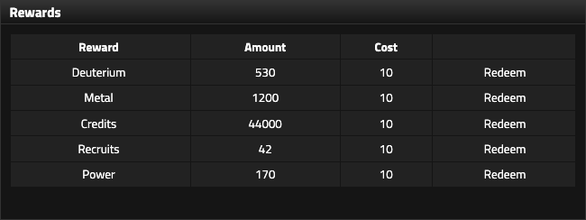

# Rewards and preferences

## Rewards

Reward Points:

- are earned through daily activity
- can be exchanged for resources
- survive death and respawn

The daily reward is **75 Reward Points**.

<figure class="sf-figure" markdown="1">
  
  <figcaption>Reward Points can be redeemed for whichever resource best relieves the empire's current bottleneck. These Horizon LIII bundles each cost 10 Reward Points.</figcaption>
</figure>

!!! note "Round-specific: Horizon LIII"
    Reward exchange rates can change between rounds. The values below are Horizon LIII rates for **10 Reward Points**.

| Reward | Amount |
|---|---:|
| Deuterium | 530 |
| Metal | 1,200 |
| Credits | 44,000 |
| Recruits | 42 |
| Power | 170 |

Alliance Catch Up does not appear to change these exchange rates.

!!! tip "Planning note"
    Reward Points are flexible bottleneck relief. Redeem the resource that enables the most valuable next action, not the one with the largest-looking number.

## Preferences

Preferences includes controls for:

- VIP settings
- Delete Empire
- Delete Account
- Vacation Mode
- Leave Newbie Mode
- Default Ship Type
- Autocomplete Cadet Training

### Recommended defaults for a new player

**Cadet Training:** Manual.

**Default Ship Type:** choose deliberately. Fixed is a strong default when a ship already has a defined job; Flexible is useful when role mobility justifies the 5% combat penalty.

**Leave Newbie Mode:** only when a specific action requires it.

## VIP gameplay features

Supporter benefits can change, so use the live VIP/Patreon page for the definitive tier list.

### Falcon tier - $10/month

Gameplay benefits include:

- 1 Research Queue slot
- Auto-Claim Rewards
- Change Race on Respawn
- Ship Salvage as starting research
- lower-tier benefits

### Dreadnaught tier - $15/month

Adds:

- 2 Research Queue slots
- Ship Production Calculator
- lower-tier benefits

### Titan tier - $25/month

Includes the earlier gameplay benefits plus additional community/VIP access.

Lower Eagle and Frigate tiers are primarily community/supporter tiers; Frigate also includes automatic alliance donation on death.
